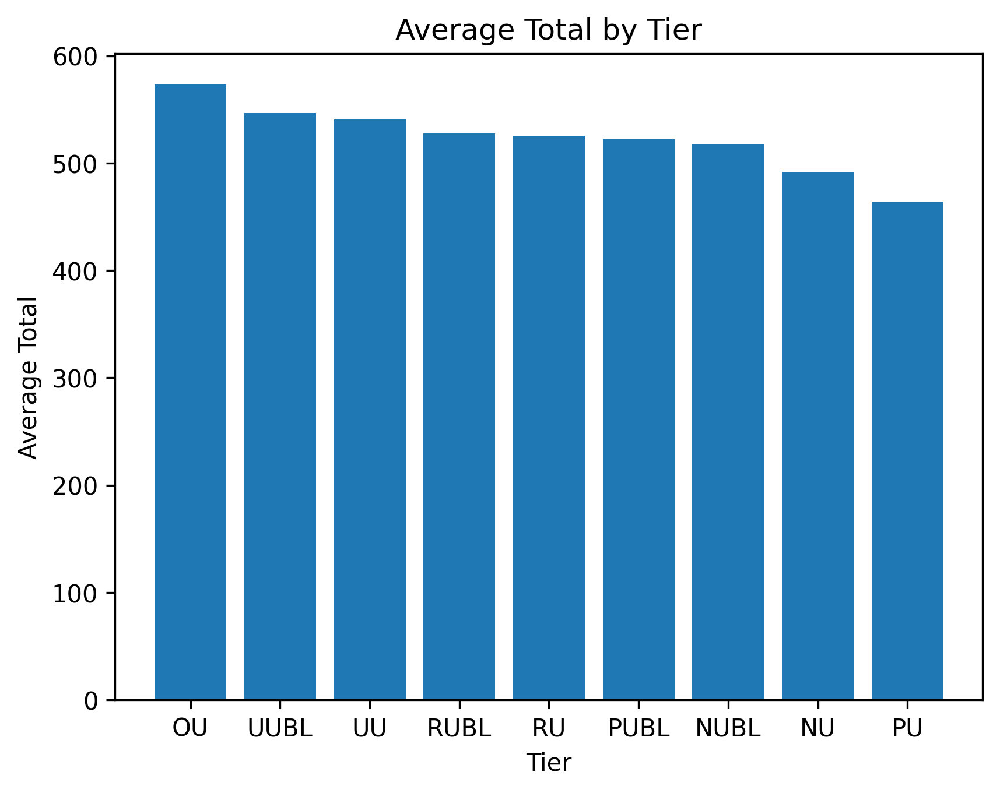
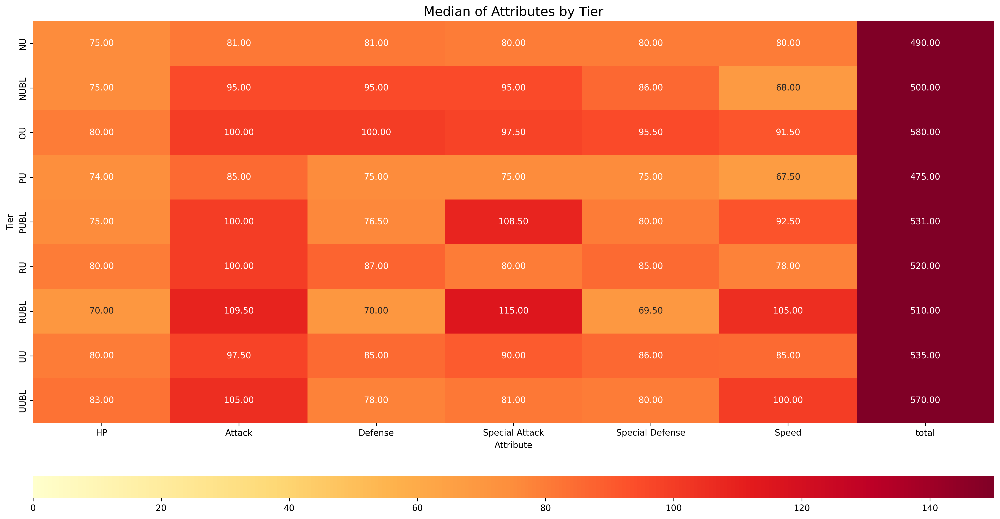
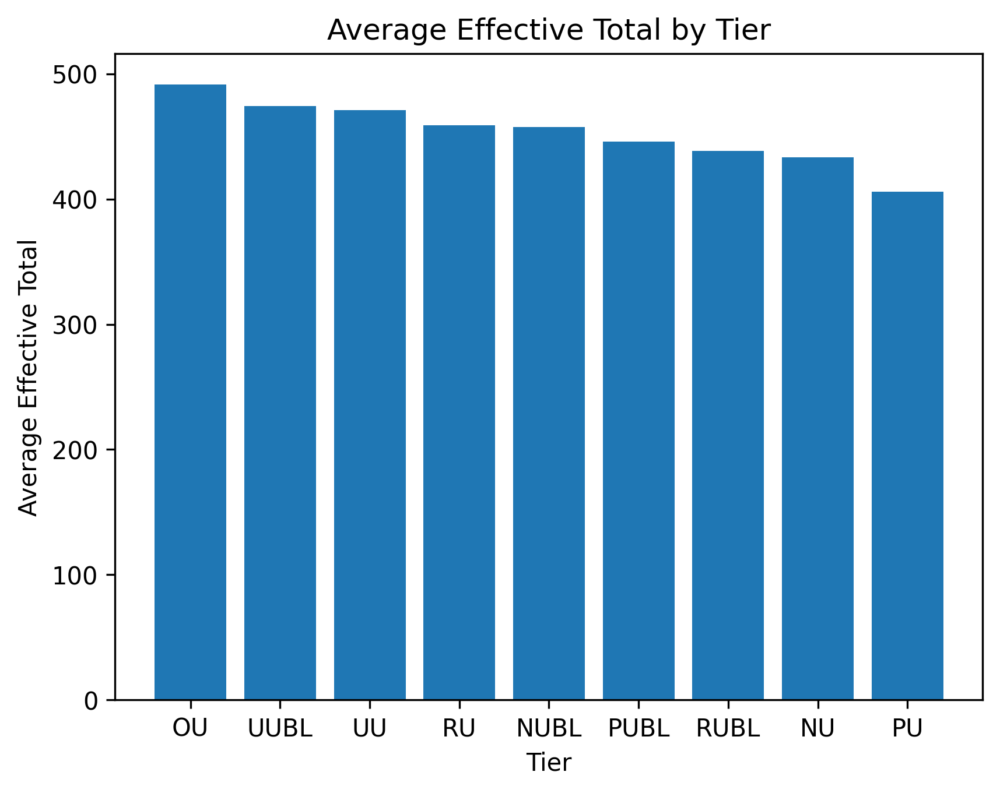
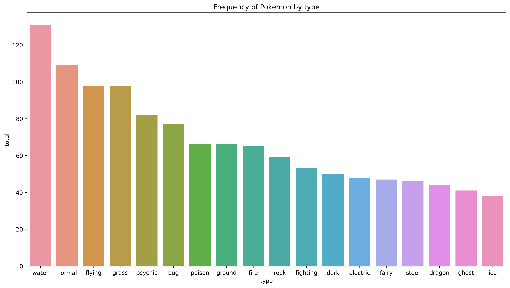
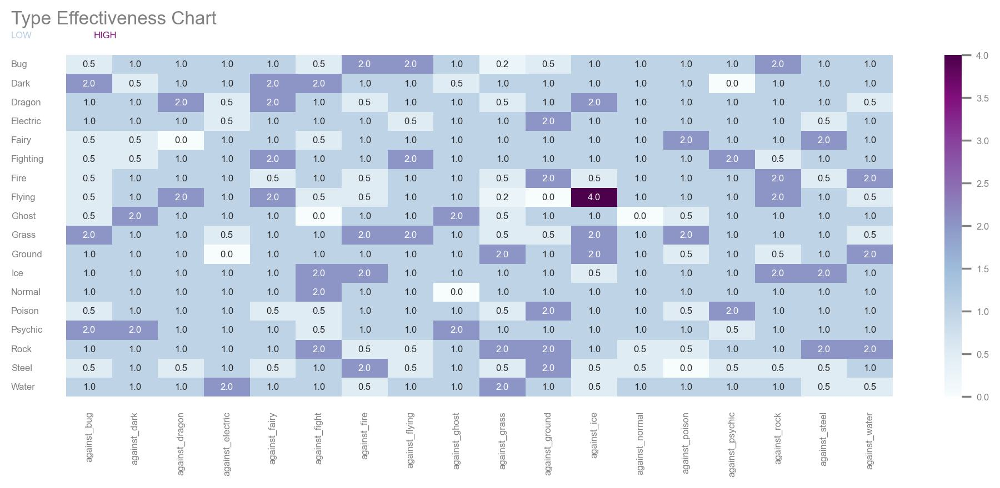
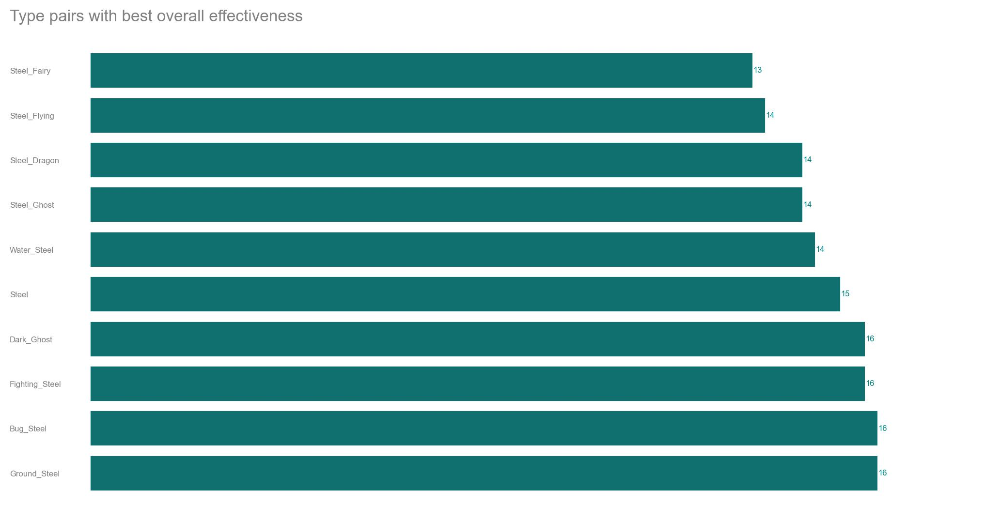

[Website](https://tachi-67.github.io/pokemon-data-story/) | [Website Repository](https://github.com/Tachi-67/pokemon-data-story) | [Process Book](https://github.com/com-480-data-visualization/project-2023-les-derniers-vainqueurs/blob/master/ProcessBook.pdf) | [Screencast](TODO)
# Project of Data Visualization (COM-480)

| Student's name | SCIPER |
| -------------- | ------ |
|Haolong Li |352680 |
|Xingyue ZHANG |351693 |
|Yuheng Lu |351636 |

[Milestone 1](#milestone-1) • [Milestone 2](#milestone-2) • [Milestone 3](#milestone-3)

## Milestone 1 (23rd April, 5pm)


### Dataset


>
Our data are retrieved from 
- [Pokemon All Status Data (Gen1 to 9)](https://www.kaggle.com/datasets/takamasakato/pokemon-all-status-data) 
- [Complete Competitive Pokemon Dataset](https://www.kaggle.com/datasets/n2cholas/competitive-pokemon-dataset)
- [The Complete Pokemon Dataset](https://www.kaggle.com/datasets/rounakbanik/pokemon)

The data are pre-downloaded into our ```./data``` folder

Our exploratory data analysis shows that the datasets are clean. Missing values are by design of the game, for convenience of analysis, we replace the Missing values with "NO INFO"

Starting from Generation 8 of the Pokemon game, Mega-Pokemons are removed. For the sake of simplicity and correction, we will remove all the Mega-pokemons in our data.

Cleaned data are stored at ```./data``` as well.

### Problematic

The visualization is targeted for Pokemon game lovers to help them form a strong pokemon combination for combat.

We want to find what exactly determines the tier of pokemons in the pokemon competitions so that we can make a better recommendation. Generally, a pokemon is considered stronger if the sum of its 6 parameters(HP, Normal Attack, Normal Defense, Special Attack, Special Defense and Speed) is higher. However, many pokemons with not so high sum are used more frequently in the game. Therefore, we need to consider far more than just the sum of the 6 parameters.

First, we need to find which parameter is the most determining parameter in pokemon competitions. We should find this by looking into the most frequently used pokemons(in the dataset, it relates to the OU in Tier). We need to compare pokemons in OU tier with those in other tiers to find the most crucial parameter. 

Then, we should define the effective sum of 6 parameters. Different pokemons undertake different roles in a game. So they may not need every parameter. For example, we need pokemon A and B to become normal attackers in a game, so A and B do not need the parameter "Special Attack". The effective parameters are the other 5 parameters for both A and B. Therefore, if the sum of the 6 parameters of A is 520 while that of B is 500, but the special attack of A is 100 while that of B is 20, then it will be reasonable to believe B is stronger than A due to a better assignment of the parameters. The definition of the effective rate will change for different roles of pokemons. For those pokemons with speed less than 50, the effective sum is defined as (total-speed), while for other pokemons we treat them as either a Normal Attacker or a Special Attacker. For Normal Attackers, their effective sum is defined as (total – special attack) while for Special Attackers the definition is (total – normal attack). We can visualize whether a pokemon with higher effective sum of 6 parameters tends to be more frequently used.

Besides, we need to find the best abilities for pokemons so that if a pokemon has a good ability, we can believe it has the potential to be stronger. We can use the pokemons in higher tier, for example, tier OU, to do the research. We need to find the most frequently used abilities and show them in a diagram.

Finally, we should find which combinations of two types of a pokemon have the best defense against all moves. When a pokemon is attacked by other pokemons’ move, if its type is resistant to the type of move, it will be able to lose less HP. Therefore, a good combination of types provides a better defense. Similarly, we can also find the combinations of types that serves as the best attacker as well.


### Exploratory Data Analysis

#### Data Preprocessing

We replaced all missing values with "NO INFO" and removed all mega-pokemon since mega-pokemons are no longer existing after Generation 8, they will not be useful for our analysis results.

#### The data

Our data contains metadata about a pokemon, for the sake of simplicity we will not go through all features (for details, please visit [Our Analysis Pipeline](./DataAnalysisPipeline.ipynb)).  

To evaluate if a pokemon is a good fighter, we are interested in the following properties:
- ```HP```
- ```Attack```
- ```Defense```
- ```Special Attack```
- ```Special Defense```
- ```Speed```

From our dataset - [Complete Competitive Pokemon Dataset](https://www.kaggle.com/datasets/n2cholas/competitive-pokemon-dataset) we are able to compute the following statistics:
|       |       HP |   Attack |   Defense |   Special Attack |   Special Defense |    Speed |
|:------|---------:|---------:|----------:|-----------------:|------------------:|---------:|
| count | 868      | 868      |  868      |         868      |          868      | 868      |
| mean  |  69.0472 |  77.5979 |   72.7465 |          71.0196 |           70.8675 |  67.0841 |
| std   |  26.4604 |  30.6864 |   29.9586 |          31.2892 |           27.5589 |  28.4854 |
| min   |   1      |   5      |    5      |          10      |           20      |   5      |
| 25%   |  50      |  55      |   50      |          46      |           50      |  45      |
| 50%   |  65      |  75      |   70      |          65      |           69      |  65      |
| 75%   |  80      | 100      |   90      |          92.5    |           87      |  90      |
| max   | 255      | 181      |  230      |         180      |          230      | 180      | 

To examine the frequency of usage of a pokemon by players, we can use the data from the competitive dataset:
- ```Tier```: It takes the value ```['PU', 'LC', 'NU', 'Uber', 'RU', 'UUBL', 'UU', 'OU', 'PUBL',
       'NUBL', 'RUBL', 'Limbo']```, among them, ```OU``` means the pokemon is the most used.

Every Pokemon could take 1 to 3 ```abilities```. Therea are in total 295 abilities. However when during combat, a pokemon could only choose one ability to battle. As a demonstration we plot the ability distribution of pokemons


To see the interactive plot, please kindly visit our [Data Analysis Pipeline](./DataAnalysisPipeline.ipynb)

Every Pokemon coule take 1 to 2 ```Type```, different type and type combinations have different defense against other type and type combinations. As demonstration we plot the size of different types here.


To see the interactive plot, please kindly visit our [Data Analysis Pipeline](./DataAnalysisPipeline.ipynb)


### Related work


We have looked into what others have done with the datasets to get inspiration. On a basic level, there are many visualisations on the basic attributes of Pokemons (e.g. height, weight, count for different species, legendary Pokemon with their total points, top Pokemons with their attack value, etc.). Further, people have explored more interesting questions: Is there correlation between the speed of Pokemon and other base factors? How many Pokemons are there in each generation? What is the relationship between type and catch rate? What is the capture rate by generation and by primary type? Which type is the most likely to be a legendary Pokemon? How many abilities does one Pokemon have? How are attributes correlated? Of course, we always want to find out which Pokemon is the strongest and which is the weakest. There is analysis on this question by summing up all the base statistics. We also came across one project on Pokemon classification with supervised learning using our chosen datasets, which is quite intriguing. 

Our project has a different objective compared with the work we encountered. We would like to combine several datasets to better serve our purpose since each dataset has a different focus. Our objective is to offer Pokemon players information about how to better choose Pokemon and their abilities through visualisation. This way, without diving into all the technical information, players can learn about which pokemon to choose and which the best ability is very easily and thoroughly. 

Our inspiration came from our passion about the game. There are nine generations of Pokemon and various types of them. Each species has so many attributes. The datasets are complete and very versatile. We were excited to explore the datasets and see what coems up. The exploration is also meaningful since we think about the actual game-playing so that there is a general direction that leads us.


## Milestone 2 (7th May, 5pm)

**10% of the final grade**

Our website is [here](https://paddler2022.github.io/).

### Basic factors that determines pokemons' strength：natures

Each Pokémon has its own 6 basic **natures**: HP, Attack, Defense, Special Attack, Special Defense and Speed. It is obivious to believe that a pokemon with higher natures is likely to perform better in the battles. In this section, we are intended to find the relation between the usage rate(Tier) and the natures of pokemons. Our ultimate goal is to present a relation between the natures and Tier and visualize it with interaction.

#### Total of natures
It is common to believe the total of 6 basic natures reveals a pokemon's power. A higher of total number is, a stronger pokemon is revealed. Therefore, we want to visualize the relation between Tier and the total as follows. We can see it almost meets our expectations. In later implementation, the chart will be replaced by the dynamic one that allows interaction created by plotly or other tools.



#### See the distribution of each nature

Then we can visualize the median of heat map of the natures using seaborn like:



#### Define the effective total

We also want to see which side(offense or defense) of battles players are more likely to emphasize. Generally, we only want a pokemon to become either an Attacker or a Special Attacker, so the offensive will be either Attack or Special Attack plus Speed that determines the sequence of moves. Therefore, we define offense total as "max[Attack, Special Attack] + Speed". For defense side, we define defense total as "Defense + Special Defense + HP". The implementation method is the same as "Average total".We can also combine both defense total and offense total and define the sum of them as "Effective total". And it is shown as below:




### Which types of pokemons should be recommended to use?
Each Pokemon has a primary type (type1) and maybe a secondary type (type2). Possible types are grass, water, fire, normal, electric, etc. For every type, there is an against_type value. For instance, there are columns in our dataset called ‘against_bug’, ‘against_dark’, ‘against_fairy’, and ‘against_flying. These values measure the amount of damage taken against an attack of a particular type. Note that the smaller the against values are, the better. Thus, these against values actually measure effectiveness. We hope the designers to treat every type of pokemon fairly. However, this is simply a dream from players. Unfortunately, pokemon designers have a certain preference on certain kind of pokemons. Therefore, it is natural to ask: which type is the strongest? Which combination of types is the strongest? In this sections we want to find this preference and then use **the chosen one** to win the pokemon battles.

#### Primary types illustration

To begin with, we want to examine how prevalent each primary type is. From Figure below, you can tell that a larger area means there is more of this type.We are envisioning an interaction where you can click a rectangle (a type), and all Pokemons of this type appear. We may use D3 to implement this later. 



#### Count the combinations of two types

Now we explore the primary and secondary types. In Figure 2,  we illustrate the count of each type as primary type and secondary type using a barchart. We are thinking about adding interaction to the plot so that when you toggle over a bar (e.g. flying and type1), the corresponding names of Pokemon will pop up. We can use D3 or Python’s Plotly to do this.


Then we look at the combination of Pokemon types. From Figure 3, we can tell that the most common Pokemon type combination is ‘Normal_Flying’. This plot is useful for our further analysis. 


#### Show the effectiveness of different types

Moreover, we plot a heatmap demonstrating each type with its corresponding effectiveness against every other type (Figure 4). The lower the value, the better. Here, we apply the knowledge about color and perception we learned in class. Bigger values correspond to darker colors. We try to choose colors that are pleasing for the eyes and easy to comprehend.



#### Choose the type combination which has the best "against" effectiveness

At last, we can find out which pair of types has the best overall effectiveness. We add up all the against columns to represent the overall effectiveness. It turns out ‘Steel_Fairy’ has the best overall effectiveness (See Figure 5). 



The above is various pieces of information that we extracted from the dataset. We want to integrate them into one or two graphs to tell a whole story. One idea is that when a Pokemon player look at our website, he/she can learn which secondary type to choose for a given primary type.  


### A research on abilities
#### What are the useful abilities?
In this section we are interested in what are the *abilities* of interest we want to recommend to pokemon users.

Every Pokemon could take 1 to 3 *abilities*. Therea are in total 295 abilities. However when during combat, a pokemon could only choose one ability to battle. As a demonstration we plot the ability distribution of pokemons


It is therefore import to choose an ability wisely as it's directly linked to a strong pokemon.

##### How do we rank abilities?

Every Pokemon has an attribute *Tier*, it takes the following different values: ```['PU', 'LC', 'NU', 'Uber', 'RU', 'UUBL', 'UU', 'OU', 'PUBL','AG'
'NUBL', 'RUBL', 'Limbo']```, among them, except for 'Uber', 'Limbo' and 'AG' which are banned using, ```OU``` means the pokemon is the most used. We will therefore rank ablities in terms of the frequentcy appeared in the ```OU``` Tier.

We already have a result:
|    | Ability           |   Count |
|---:|:------------------|--------:|
| 46 | 'Telepathy'       |       4 |
|  1 | 'Regenerator'     |       4 |
|  5 | 'Beast Boost'     |       3 |
| 29 | 'Levitate'        |       2 |
| 40 | 'Keen Eye'        |       2 |
| 33 | 'Sturdy'          |       2 |
| 22 | 'Limber'          |       2 |
| 12 | 'Mold Breaker'    |       2 |
| 19 | 'Battle Bond'     |       2 |
|  8 | 'Serene Grace'    |       2 |
|  4 | 'Pressure'        |       2 |
| 38 | 'Disguise'        |       1 |

For the sake of visualization, we are thinking about creating a horizontal sliding bar which contains the top 5 most popular abilities. Inside of the sliding bar there are 5 different icons symboling each ablity. When the mouse moves onto each icon, detailed information of the ability will be shown. This could be implemented with simple engineering.


### Visualization Methods
The visualization require certain courses like javascript, d3.js, html(of course).

The mvp is the above viz. To further implement something more, we need to refer to different viz to see what better styling / fancy things we could do, they include:
- Finding the fancy icons. (Otherwise hand-draw)
- Choosing the right styling of the feature
- Vaguing the icon upon the mouse moving onto it, could probably be done with some smart CSS configurations.
- etc.

## Milestone 3 (4th June, 5pm)

**80% of the final grade**

[Website](https://tachi-67.github.io/pokemon-data-story/) | [Website Repository](https://github.com/Tachi-67/pokemon-data-story) | [Process Book](https://github.com/com-480-data-visualization/project-2023-les-derniers-vainqueurs/blob/master/ProcessBook.pdf) | [Screencast](TODO)


## Late policy

- < 24h: 80% of the grade for the milestone
- < 48h: 70% of the grade for the milestone

